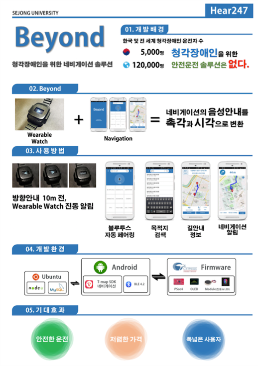
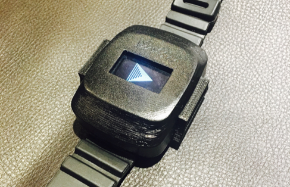
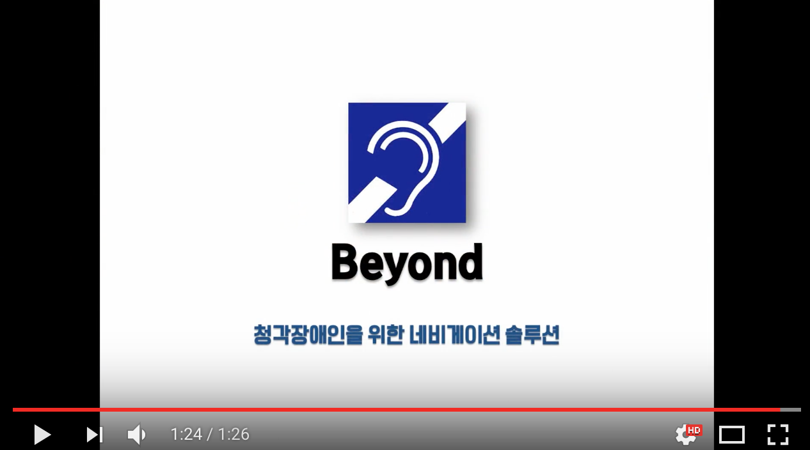
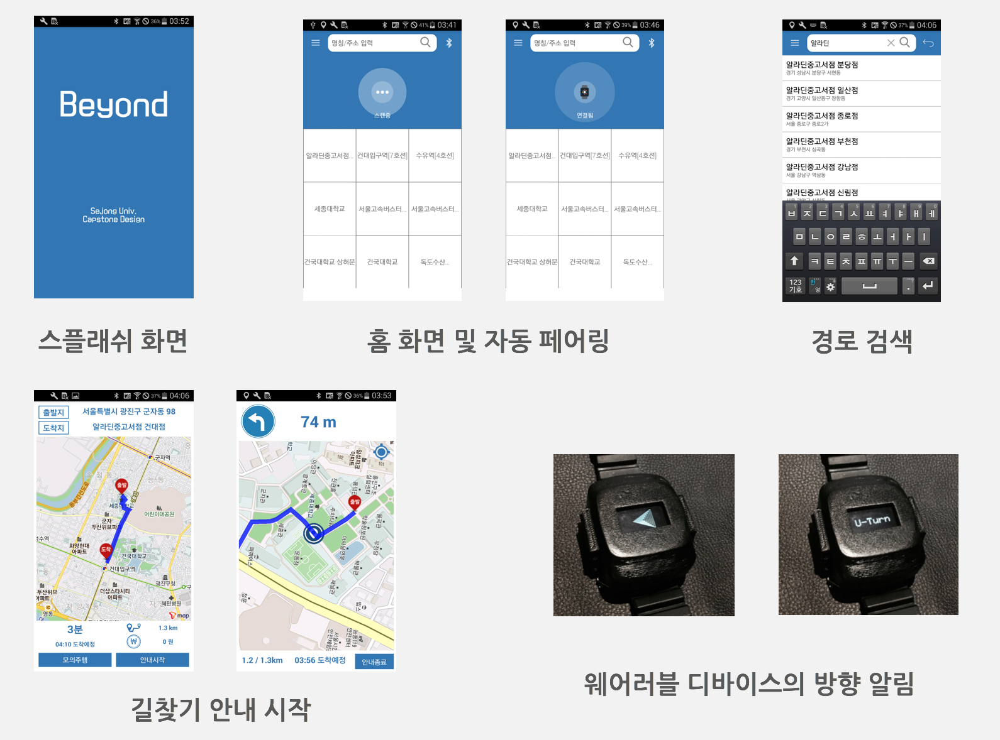
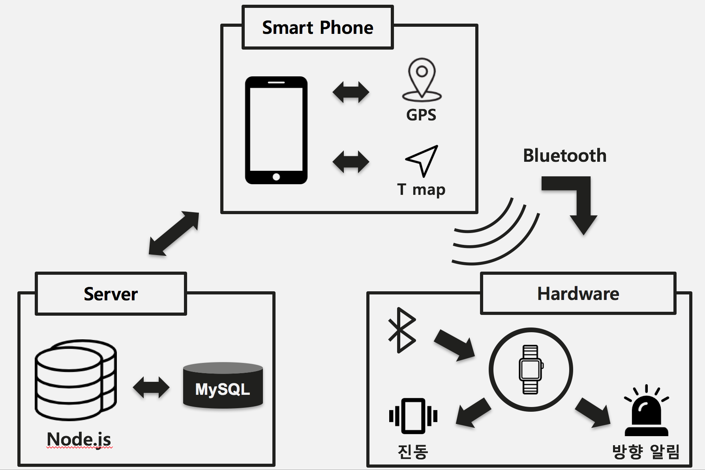
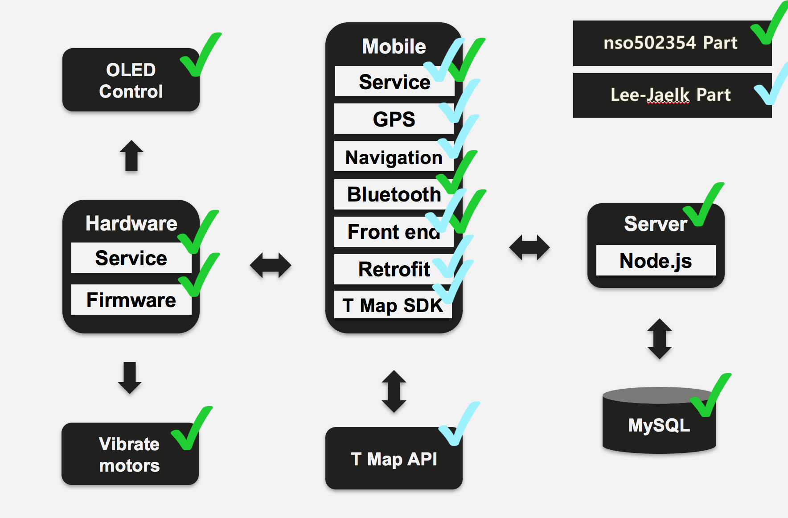

# Beyond

> 세종대학교 2016년 2학기 Capsone Design 설계 강의에서 진행한 팀프로젝트이며, 안드로이드(4.4, KitKat)과 Cyperss사 BLE 하드웨어가 결합된 IoT 프로젝트입니다.

### 개요
* Beyond는 네비게이션의 음성안내를 촉각과 시각으로 변환해주는 청각장애인 네비게이션 솔루션입니다. 안드로이드 애플리케이션과 웨어러블 디바이스로 이루어져 있습니다.

* 포스터

* 웨어러블 디바이스

### 시연영상
* 동영상
 

### 동작 흐름도 및 개발 파트

* App 스크린샷

* 동작 흐름도

* 구성도

### 개발환경
* OS : Android 4.4, KitKat
* Tools : Android Studio, Arduino IDE

### 언어
* JAVA SDK 8
* Cypress language is based on C/C++
